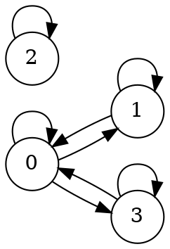
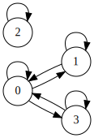

# Reflexivity, Symmetry and Transitivity

Let R be a binary relation on a set A.

* R is reflexive if for all x  A, xRx.
* R is symmetric if for all x,y  A, if xRy, then yRx.
* R is transitive if for all x,y, z  A, if xRy and yRz, then xRz.

R is an equivalence relation if A is nonempty and R is reflexive, symmetric and
transitive.  In terms of digraphs,

* Reflexivity is equivalent to having at least a loop on each vertex
* Symmetry means any arrow from one vertex to another will always be accompanied by another arrow in the opposite direction
* Transitivity is the same as saying there must be a direct arrow from one vertex to another if one can walk from that vertex to the other through a list of arrows, travelling always along the direction of the arrows.

Examples

Let A={ 0,1,2,3} and a relation R on A be given by

    R={ (0,0), (0,1), (0,3), (1,0), (1,1), (2,2), (3,0), (3,3) } .

Is R reflexive? symmetric? transitive?

Solution We'll make use of the digraph for R on the right.

- (a) R is reflexive, i.e. there is a loop at each vertex.
- (b) R is symmetric, i.e. the arrows joining a pair of different vertices always appear in a pair with opposite arrow directions.
- (c) R is not transitive. This is because otherwise the arrow from 1 to 0 and arrow from 0 to 3 would imply the existence of an arrow from 1 to 3 (which doesn't exist). In other words (1,0)  R, (0,3)  R and (1,3)  R imply R is not transitive.

## Activities

Create a program in python that define if a set is reflexive, symmetric or transitive
Input string : 

	{ (0,0), (0,1), (0,3), (1,0), (1,1), (2,2), (3,0), (3,3) }

Output:

- (a) R is reflexive, 
- (b) R is symmetric,
- (c) R is not transitive. 
- (d) R does not have equivalence relation 

## Graph in graphviz

Script shoudl also geneate the file graph.log : 

To be tested in https://dreampuf.github.io/GraphvizOnline/

