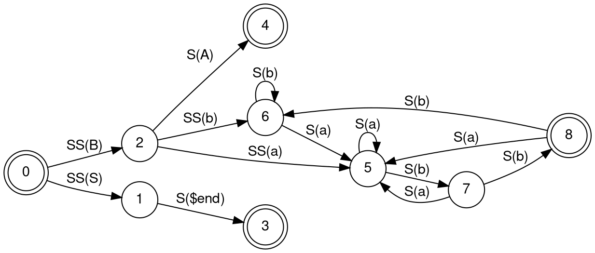

# EQUIVALENCE WITH FINITE AUTOMATA

Regular expressions and finite automata are equivalent in their descriptive
power. This fact is surprising because finite automata and regular expressions
superficially appear to be rather different. However, any regular expression
can be converted into a finite automaton that recognizes the language it
describes, and vice versa. Recall that a regular language is one that is
recognized by some finite automaton.

A language is regular if and only if some regular expression describes it.

## Activities

Create a program in python that create the equivalence with finite automata:

Alphabet: {0,1} or {a,b}
Alphaphet symbol: A
Empty stringsymbol : E

Example of Input string : (ab ∪ a)*

We convert the regular expression (ab ∪ a)* to an NFA in a sequence of stages.
We build up from the smallest subexpressions to larger subexpressions until we
have an NFA for the original expression, as shown in the following diagram

Output (does not correspond to (ab ∪ a)*  regex):

To be tested in https://dreampuf.github.io/GraphvizOnline/

